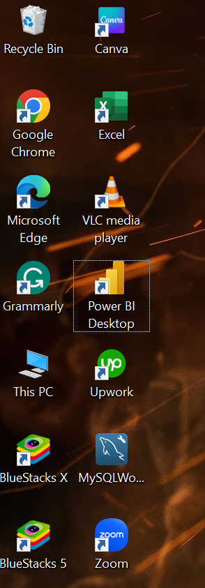
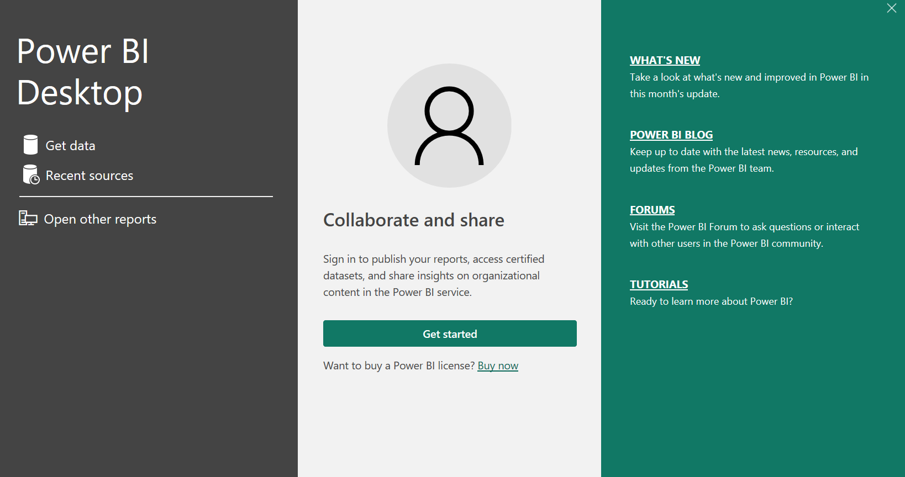
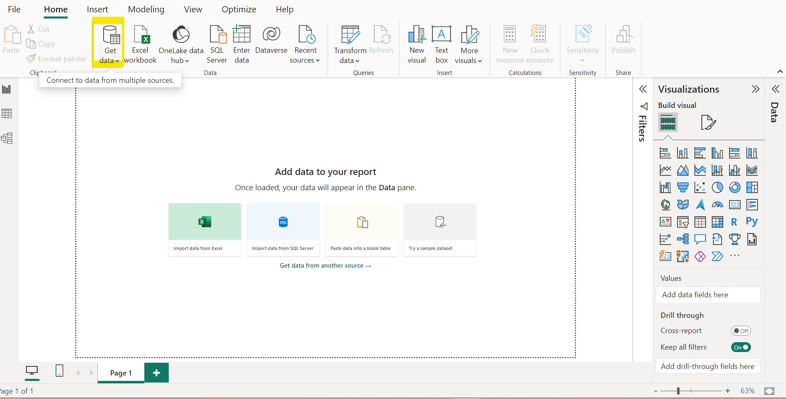
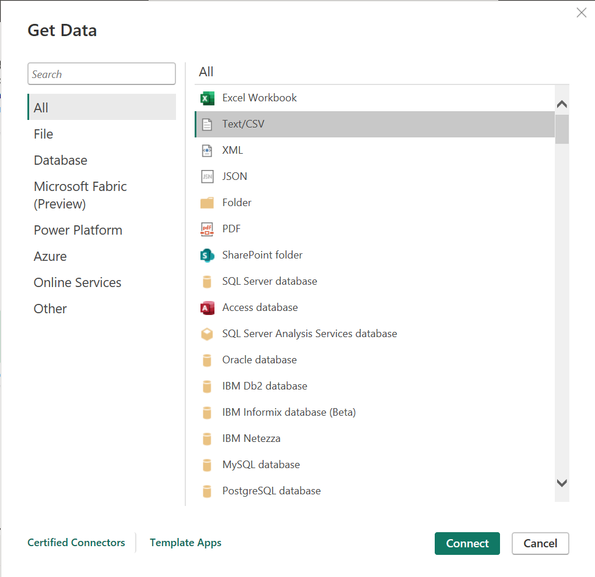
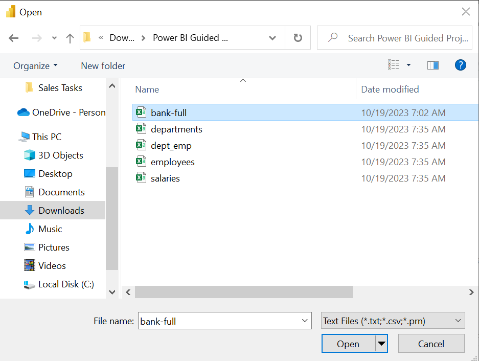
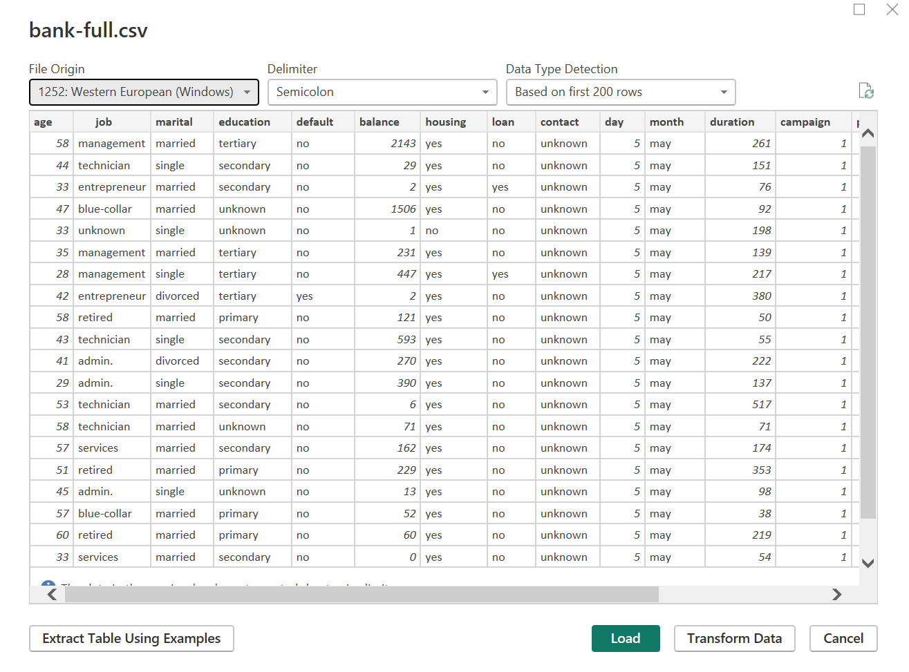
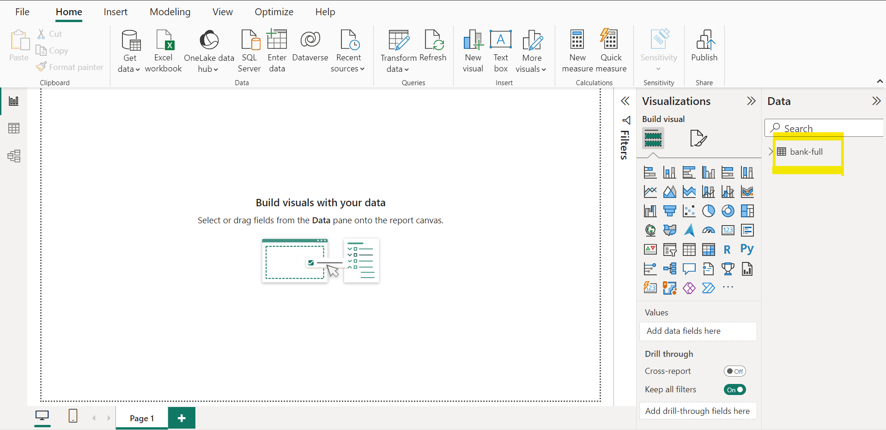
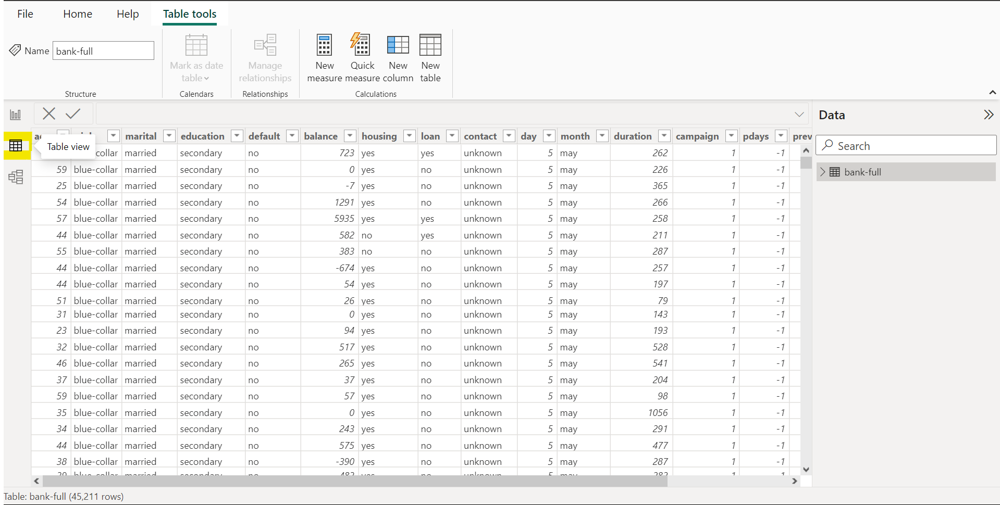

# DATASET INTEGRATION

## INTRODUCTION

In this task, we will focus on seamlessly integrating the 'Bank Term Deposit Subscription' dataset into Power BI Desktop using the convenient CSV file option. Efficient data importation is a crucial step in the data analysis process, and Power BI provides a user-friendly interface for managing and visualizing datasets. By following this guide, you will learn how to import the specified dataset, paving the way for insightful analysis and meaningful visualizations within the Power BI environment. Let's dive into the step-by-step process of importing the dataset and unlocking the powerful features of Power BI for effective decision-making.

## PROBLEM STATEMENT

Organizations often encounter challenges when attempting to integrate external datasets into their analytics tools. The current task revolves around the necessity to:

- Import the 'Bank Term Deposit Subscription' dataset into Power BI Desktop using the CSV file option.

The problem lies in the potential complexities and uncertainties associated with this data integration process. Users may face issues related to data formatting, compatibility, or simply navigating through Power BI Desktop's features for successful importation.

The task at hand aims to address these challenges by providing a clear and systematic guide on how to efficiently import the specified dataset, ensuring a smooth and error-free integration process within the Power BI environment.

## SKILLS AND CONCEPTS TO BE DEMOSTRATED

1. Data Importation:
   - Showcasing the ability to import datasets into Power BI Desktop, specifically using the CSV file option.
2. File Handling:
   - Demonstrates proficiency in handling CSV files, including understanding file structures, locating files, and ensuring data consistency.
3. Power BI Desktop Navigation:
   - Illustrates the knowledge of navigating through Power BI Desktop's interface to locate and access the necessary features for data import.
4. Documentation:
   - Stress the importance of documenting the data importation process for future reference, including any custom configurations or transformations applied.

By successfully demonstrating these skills and concepts, participants will gain a comprehensive understanding of how to import and integrate datasets effectively using Power BI Desktop.

## DATA IMPORTATION STEPS, DISCUSSION AND RESULT

- ### STEP 1 and 2
  To initiate the 'Bank Term Deposit Subscription' dataset import into POWER BI, begin by locating the POWER BI Desktop app within the system. Double-click to open the application. Upon opening, you will be greeted with a collaborative and sharing page, featuring a "Get Started" option below. Click on "Get Started" to seamlessly navigate to the POWER BI environment.

STEP 1       | STEP 2
:------------:|:------------:
| 

- ### STEP 3 and 4
  Following successful navigation to the POWER BI environment, proceed to the next step by choosing and clicking on the "Get Data" button located in the Home tab of the Power BI Desktop ribbon. This action will trigger the appearance of a data source page, from which you should select the "Text/CSV" option and then click on the "Connect" button.

STEP 3       | STEP 4
:------------:|:------------:
| 

- ### STEP 5 and 6

  Upon clicking on "Connect," a connection details page will emerge. In this stage, I navigated to the Downloads folder where the CSV Bank_Full dataset was situated, selected the dataset using its file name, and clicked on "Open." This action prompts POWER BI to establish a connection, leading to a page where data cleaning or transformation can be performed if necessary. However, for the purpose of this task, which exclusively centers on data import and excludes cleaning and transformation, we will proceed by selecting the "Load" option button.

STEP 5      | STEP 6
:------------:|:------------:
| 

- ### STEP 7 and 8

  Upon clicking the "Load" option button, our dataset will be imported into POWER BI successfully. It will be located in the data pane on the right side of the POWER BI environment, highlighted in yellow as shown in the snapshot below. To confirm the successful importation and view the dataset, click on the table view icon situated on the left side of POWER BI, also highlighted in yellow in the snapshot provided below.

STEP 7      | STEP 8
:------------:|:------------:
| 

## CONCLUSION

In conclusion, this task guided us through the seamless process of importing the 'Bank Term Deposit Subscription' dataset into POWER BI. Starting with the initiation of the importation process, we navigated through the POWER BI Desktop environment, selected the dataset source, and established a connection. Emphasizing a focus on data import, we successfully loaded the dataset into POWER BI.

Upon completion, the imported dataset resides in the data pane on the right side of the POWER BI environment, as highlighted in yellow. Verification of the successful importation can be confirmed by clicking on the table view icon, also highlighted in yellow on the left side of POWER BI.

This task provides a foundation for further exploration, analysis, and visualization within the POWER BI environment. By mastering the importation process, users can now leverage the powerful features of POWER BI for meaningful insights and data-driven decision-making.

  

  

